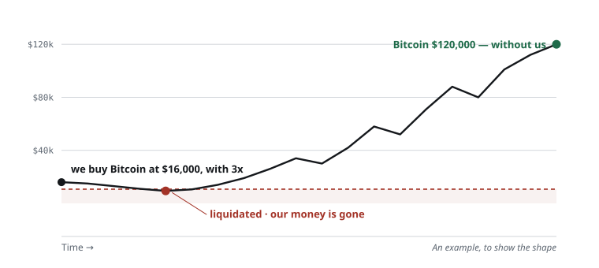
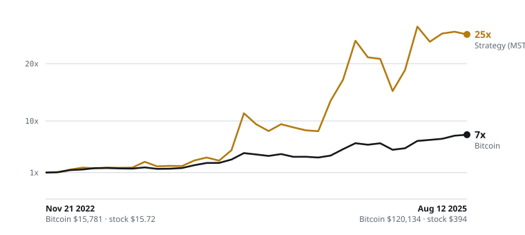

Leverage is tempting. There are two ways to get it, and only one of them can
take everything.

## The old way: 3x leverage on Bitcoin

Say we buy Bitcoin at **$16,000**, using **3x leverage**.

There is a line under us. **If Bitcoin drops below that line, we are
liquidated.** Our money is gone.

At 3x, that line sits around **$10,700**.

So Bitcoin dips. It touches the line. We are out.

Then Bitcoin recovers and runs to **$120,000**.

*We were right about Bitcoin. Our money was already gone.*

We were right, and it did not matter.

There are two more costs while we wait.

**We pay to borrow.** Leverage is borrowed money, and borrowed money charges
interest every day.

**We pay the shorts.** Longs and shorts have to balance on an exchange. Almost
everyone wants to be long, so the crowded side pays the other side every few
hours. We wanted to own Bitcoin, and we are paying the people betting against
it.

Three problems. But the third one — liquidation — is the only one that ends us.

## The new way: buy Strategy

Now the other route.

**Strategy** (ticker MSTR) is a company that hoards Bitcoin. It holds a very
large amount of it.

So its price follows Bitcoin. And every time Bitcoin moves, Strategy moves a
bit more — up faster, and down faster.

**It is not real leverage.** Nobody lent us anything. But looking at its
history, it behaves like leverage.

Here is what that looked like.

When Bitcoin was **$16,000**, Strategy was **$16**.

When Bitcoin reached **$120,000**, Strategy was **$394**.

Bitcoin went up about **7 times**. Strategy went up about **25 times**.

*Same first day, same last day. Strategy moved about 3 times Bitcoin.*

And the good part:

**No borrow fee.** Nobody lent us money.

**No fee to the shorts.** This is an ordinary stock.

**We can never be liquidated.** Not a small chance — zero. It is a stock. A
stock has no liquidation line. Bitcoin could fall to $4,000 and our shares are
still ours.

Not real leverage. But the whole shape of it is the same.

## The two ways, side by side

| | 3x leverage on Bitcoin | Buying Strategy |
|---|---|---|
| Fee to borrow | Yes, every day | **None** |
| Fee to the shorts | Yes, every few hours | **None** |
| Can we be liquidated? | Yes — and the money is gone | **Never** |
| Moves more than Bitcoin? | Yes, exactly 3x | Yes, about 3x from its history |
| Do we get paid to hold? | No | Possible — Strategy's preferred shares pay 8–10% |

Same shape of gain. None of the three problems.

## This works for other coins too

Bitcoin is only the example here.

**Ethereum** has **Bitmine** (BMNR), which hoards Ethereum the same way.

**Solana** has **Forward Industries** (FWDI).

So the method is simple: **if we are confident about a coin, we can buy this
kind of stock instead of using leverage on the coin.**

Is it risk-free? No. The stock swings harder than the coin, and sometimes the
coin rises while the stock does not.

But compared to real leverage — borrowing against our Bitcoin, or using DeFi
leverage — the risk is much smaller, for one reason that never changes:

**Nobody can close our position. Only we can.**

Let's keep researching, and let's keep improving.

---

*Exact figures: Bitcoin $15,781 and Strategy $15.72 on Nov 21 2022; Bitcoin
$120,134 and Strategy $394.39 on Aug 12 2025 — 7.6 and 25.1 times. Strategy
prices are adjusted for the 10-for-1 split in Aug 2024, and the common stock
has never paid a dividend, though Strategy's preferred shares (STRK, STRF,
STRD, STRC) pay 8–10%. The 3x walk-through is a simple example; real
liquidation levels vary by exchange and margin type. Research, not financial
advice.*
